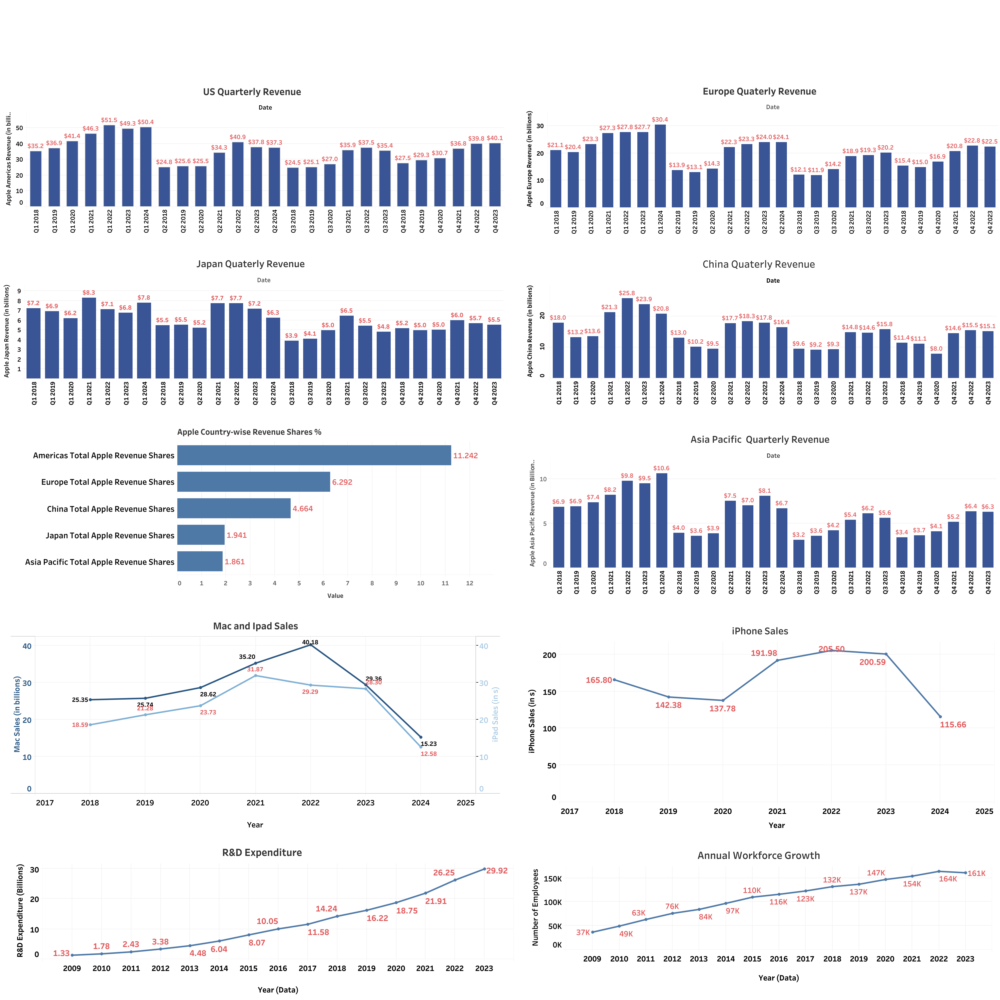

# Apple_Data_Analysis

## Project Overview

This project involves a comprehensive data pipeline, from web scraping to data visualization, focusing on Apple's sales and market performance. The process includes data collection, cleaning, augmentation, validation, and visualization using various tools and technologies.

[View Interactive Dashboard]([https://example.com/apple_dashboard_link](https://public.tableau.com/views/Apple_Data_Analysis/Dashboard1?:language=en-US&:sid=&:redirect=auth&:display_count=n&:origin=viz_share_link))

## Project Workflow

1. **Web Scraping**: 
   - Used Beautiful Soup to scrape data from two websites
   - Extracted relevant information about Apple's sales, market share, and product performance

2. **Data Storage and Initial Processing**:
   - Imported scraped data into Google Sheets
   - Performed initial data cleaning and organization

3. **Data Cleaning and Augmentation**:
   - Cleaned the data to remove inconsistencies and errors
   - Augmented the dataset to enhance its quality and quantity
   - Validated the data to ensure accuracy and reliability

4. **Data Visualization**:
   - Imported processed data into Tableau
   - Created initial dashboards to visualize key metrics and trends
   - Currently working on additional dashboards for deeper insights

## Key Features of Current Visualizations

- Revenue Shares breakdown Country-wise
- Market share analysis for various Apple products
- User base growth trends
- Quarterly performance comparisons country-wise
- R&D Expenditure Growth

## Ongoing Work

- Developing additional Tableau dashboards for more comprehensive analysis
- Refining existing visualizations based on insights gained
- Exploring advanced data analysis techniques to uncover deeper trends

## Technologies Used

- Web Scraping: Beautiful Soup (Python)
- Data Storage and Initial Processing: Google Sheets
- Data Visualization: Tableau

This project demonstrates a full-cycle data analysis process, from raw data collection to insightful visualizations, providing valuable insights into Apple's market performance and trends.
